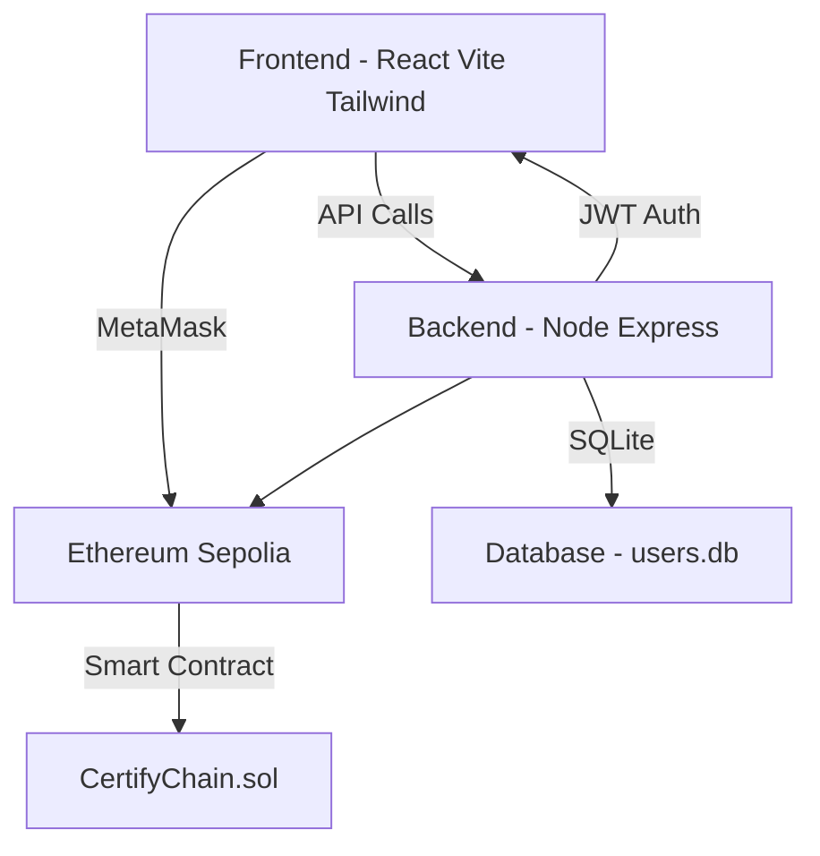

# The Hexagon Ledger: Blockchain-Based Skill Credentialing System

## Table of Contents

1. [Project Overview](#1-project-overview)  
2. [Problem Statement (SIH)](#2-problem-statement-sih)  
3. [Our Solution](#3-our-solution)  
4. [Features](#4-features)  
5. [Technical Architecture](#5-technical-architecture)  
   - [Frontend](#frontend)  
   - [Backend](#backend)  
   - [Database](#database)  
   - [Blockchain & Smart Contract](#blockchain--smart-contract)  
6. [Setup & Installation](#6-setup--installation)  
   - [Prerequisites](#prerequisites)  
   - [Environment Variables](#environment-variables)  
   - [Running with Docker](##running-with-docker)  
   - [Running Manually](#running-manually)  
7. [Usage Guide](#7-usage-guide)  
   - [Learner Workflow](#learner-workflow)  
   - [Employer Workflow](#employer-workflow)  
8. [Smart Contract Details](#8-smart-contract-details)  
9. [Future Enhancements](#9-future-enhancements)  
10. [Team](#10-team)  
11. [License](#11-license)

---

## 1. Project Overview

The **Hexagon Ledger** is a blockchain-powered skill credentialing system designed to modernize vocational certification through **tamper-proof, interoperable, instantly verifiable digital credentials** stored on Ethereum.

---

## 2. Problem Statement (SIH)

**ID:** 25200  
**Ministry:** Ministry of Skill Development and Entrepreneurship (MSDE)  
**Title:** Blockchain-Based Skill Credentialing System  

### Key Issues
- High risk of certificate forgery  
- No interoperability between institutions  
- No lifelong digital access for learners  
- Slow, manual verification processes  

A secure, unified, decentralized verification system is required.

---

## 3. Our Solution

- **Immutable Blockchain Proof:** Certificates hashed and stored on Ethereum Sepolia.  
- **Instant Verification:** Employers verify via wallet address or QR code.  
- **Learner Ownership:** Credentials belong permanently to learners.  
- **Interoperable:** All institutions can verify using the same ledger.

---

## 4. Features

### For Learners
- Secure authentication  
- Certificate upload (PDF/Image)  
- SHA-256 hashing  
- Issue credentials via MetaMask  
- Download unique QR code  
- Maintain multiple credentials on one identity  

### For Employers
- Secure authentication  
- Verify using:
  - Wallet address  
  - Live QR scan  
  - QR image upload  
- View all on-chain credentials  
- Hash-compare uploaded certificates

---

## 5. Technical Architecture

### System Diagram



### Frontend

**Technologies:** React.js, Vite, Tailwind CSS, Framer Motion  
**Libraries:** react-router-dom, axios, ethers.js, qrcode.react, html5-qrcode, jsQR, lucide-react

**Role:**  
- Presents the UI for learners and employers.  
- Computes file SHA-256 hashes locally.  
- Integrates with MetaMask to sign/send transactions.  
- Generates, displays and scans QR codes.  
- Calls backend APIs for authentication and blockchain read proxies.

#### Frontend — Component & Route List
- `App` — root; provides Router + Auth context.
- `Auth`  
  - `Login` — login form.  
  - `Register` — registration form.
- `Dashboard`  
  - `LearnerDashboard` — upload, issue, view issued credentials.  
  - `EmployerDashboard` — search/verify learner credentials.  
- `UploadCertificate` — file chooser, hashing UI, preview.  
- `IssueCredential` — interacts with MetaMask and smart contract helper.  
- `CredentialList` — shows issued credentials for current wallet.  
- `VerifyCredential` — accepts wallet address / QR scan / QR upload.  
- `QRCodeCard` — generates and downloads wallet-address QR.  
- `CameraScanner` — live QR scanning using html5-qrcode.  
- `QRCodeUploader` — upload QR image and decode via jsQR.  
- `Profile` — account details and logout.  
- `NotFound`, `Loading`, and shared UI primitives (Modal, Toast).

#### Frontend — Routes (react-router)
- `/` → Landing / Login (public)  
- `/register` → Register (public)  
- `/dashboard` → Protected; loads `LearnerDashboard` or `EmployerDashboard` depending on role  
- `/upload` → Upload certificate page (learner)  
- `/issue` → Issue credential flow (learner)  
- `/verify` → Verify credential flow (employer)  
- `/profile` → Account settings

---

#### Frontend — State Shape (sample Redux / Context)
```js
// authContext / auth slice
{
  user: {
    id: number,
    username: string,
    role: 'learner' | 'employer',
    walletAddress?: string
  },
  token: string | null,
  isAuthenticated: boolean,
  loading: boolean,
  error: string | null
}

// ui state
{
  toast: { message, type },
  modal: { visible, content }
}

// credential flow
{
  currentFile: File | null,
  fileHash: string | null,           // SHA-256 hex
  selectedWallet: string | null,     // MetaMask selected account
  txStatus: 'idle'|'pending'|'success'|'failed',
  issuedCredentials: Credential[]    // cached list from contract via backend
}
````

#### Frontend — Data / API Contracts (Request & Response examples)

**Auth - Register**

```
POST /api/auth/register
Body:
{
  "username": "alice",
  "password": "securepass",
  "role": "learner"
}

Response 201:
{
  "id": 1,
  "username": "alice",
  "role": "learner",
  "token": "jwt..."
}
```

**Auth - Login**

```
POST /api/auth/login
Body:
{
  "username": "alice",
  "password": "securepass"
}

Response 200:
{
  "id": 1,
  "username": "alice",
  "role": "learner",
  "token": "jwt..."
}
```

**Backend - Get On-Chain Credentials (proxy read)**

```
GET /api/credentials/:walletAddress
Headers: Authorization: Bearer <token>

Response 200:
{
  "wallet": "0xabc123...",
  "credentials": [
    {
      "certHash": "0xdeadbeef... (sha256 hex)",
      "timestamp": 1700000000,
      "issuer": "0xissuerAddr..."
    },
    ...
  ]
}
```

**Backend - Compare Local Hash Against On-Chain Records**

```
POST /api/credentials/compare
Body:
{
  "wallet": "0xabc123...",
  "localHash": "0xdeadbeef..."
}
Response:
{
  "match": true,
  "matches": [
    {
      "certHash": "0xdeadbeef...",
      "timestamp": 1700000000,
      "issuer": "0xissuerAddr..."
    }
  ]
}
```

---

#### Frontend — File Hashing & Issue Flow (step-by-step)

1. Learner selects a file in `UploadCertificate`.
2. Client computes SHA-256 hash of the file bytes **locally** (no upload yet). Example using Web Crypto API:

   ```js
   const hashBuffer = await crypto.subtle.digest('SHA-256', fileArrayBuffer)
   const hashHex = [...new Uint8Array(hashBuffer)].map(b => b.toString(16).padStart(2,'0')).join('')
   ```
3. Show `fileHash` preview to the user and store in state.
4. User clicks `Issue Credential`:

   * Connect MetaMask (if not yet connected) and select account.
   * Build transaction payload for the smart contract `issueCredential(learnerAddress, certHash)`.
   * Show MetaMask confirmation modal and send transaction through ethers.js provider.
5. After transaction mined, call backend to refresh read-proxy (or poll `getCredentials`), then display success and show generated QR code for wallet address.

---

#### Frontend — QR payload & Formats

* **QR content (plain)**: the learner wallet address (e.g., `0xabc123...`).
* **QR content (optional JSON)**:

  ```json
  {
    "wallet": "0xabc123...",
    "name": "Chandra Student",
    "issuedAt": 1700000000
  }
  ```
* QR code downloadable as PNG/SVG. Employer scanners accept both raw address or JSON.

---

#### MetaMask / ethers.js interactions (high-level)

* Use `window.ethereum.request({ method: 'eth_requestAccounts' })` to request account.
* Create `ethers.providers.Web3Provider(window.ethereum)` and `provider.getSigner()` to sign/send transactions.
* Use contract ABI + signer to call `issueCredential` (gas-paying transaction).
* For read operations, prefer `provider` or backend RPC via Alchemy/Infura.

---

### Backend

**Technologies:** Node.js, Express.js
**Libraries:** cors, dotenv, jsonwebtoken, bcryptjs, sqlite3, ethers.js

**Role:**

* User authentication (JWT) and account management.
* Stores user login records in SQLite (no credential data).
* Acts as a **read-proxy** for blockchain queries to avoid client-side RPC rate issues and to keep RPC keys secret.
* Provides protected endpoints for credential lookups and hash comparison.

#### API Endpoints (summary)

* `POST /api/auth/register` — create account.
* `POST /api/auth/login` — obtain JWT.
* `GET /api/credentials/:walletAddress` — returns all credentials from contract for address.
* `POST /api/credentials/compare` — compare provided hash to on-chain credentials.
* `GET /api/profile` — returns authenticated user profile.
* `POST /api/admin/issue` — (optional) server-side issuance if using backend-signed txs (requires PRIVATE_KEY).

#### Backend — Sample Proxy Logic (pseudo)

* `GET /api/credentials/:addr`:

  * create `ethers` provider with API_URL.
  * instantiate `CertifyChain` contract with ABI + provider.
  * call `getCredentials(addr)`, parse array, return JSON.

---

### Database

**Technology:** SQLite (file-based)
**File:** `cert-backend/users.db`

**Tables**

```sql
CREATE TABLE users (
  id INTEGER PRIMARY KEY AUTOINCREMENT,
  username TEXT UNIQUE NOT NULL,
  password TEXT NOT NULL,  -- bcrypt hashed
  role TEXT NOT NULL,      -- 'learner' | 'employer' | 'admin'
  wallet_address TEXT      -- optional: store learner's linked wallet
);
```

**Notes**

* Only authentication-related user data stored here.
* No certificate contents or hashes are stored off-chain in the DB.
* For audits or optional features, minimal metadata (e.g., `lastLogin`, `displayName`) may be added.

---

### Blockchain & Smart Contract

**Network:** Ethereum Sepolia Testnet
**Language:** Solidity
**Contract:** `CertifyChain.sol`

#### Solidity Data Structures

```solidity
struct Credential {
  string certHash;
  uint256 timestamp;
  address issuer;
}

mapping(address => Credential[]) public credentials;
```

#### Key Functions

```solidity
function issueCredential(address _learner, string memory _certHash) external;
function getCredentials(address _learner) external view returns (Credential[] memory);
```

#### Recommended ABI (example snippet)

```json
[
  {
    "inputs":[{"internalType":"address","name":"_learner","type":"address"},{"internalType":"string","name":"_certHash","type":"string"}],
    "name":"issueCredential",
    "outputs":[],
    "stateMutability":"nonpayable","type":"function"
  },
  {
    "inputs":[{"internalType":"address","name":"_learner","type":"address"}],
    "name":"getCredentials",
    "outputs":[{"components":[{"internalType":"string","name":"certHash","type":"string"},{"internalType":"uint256","name":"timestamp","type":"uint256"},{"internalType":"address","name":"issuer","type":"address"}],"internalType":"structCertifyChain.Credential[]","name":"","type":"tuple[]"}],
    "stateMutability":"view","type":"function"
  }
]
```

#### Security & Gas Notes

* Use string for `certHash` (hex) to simplify on-chain storage. Consider bytes32 to reduce gas (if hash fits).
* Consider access control for issuance (e.g., only authorized issuers) in production.
* For cost reduction, batch issuance and L2 solutions (Polygon, zk-rollups) recommended.

---

## 6. Setup & Installation

(Keep same as previous README; included here so this section is self-contained.)

### Prerequisites

* Git
* Node.js (LTS)
* npm
* Docker Desktop (optional but recommended)
* MetaMask configured for Sepolia
* Sepolia ETH (faucet)
* Deployed `CertifyChain.sol` address and ABI

### Environment Variables

#### `cert-backend/.env`

```env
API_URL="YOUR_SEPOLIA_RPC_URL"
PRIVATE_KEY="YOUR_WALLET_PRIVATE_KEY"        # required only if backend sends txs
CONTRACT_ADDRESS="YOUR_DEPLOYED_CONTRACT_ADDRESS"
JWT_SECRET="a_very_long_and_random_secret_key"
```

#### `frontend/.env`

```env
VITE_API_BASE_URL="http://localhost:3001"
```

### Running with Docker

```bash
git clone https://github.com/YOUR_GITHUB_USERNAME/YOUR_REPO_NAME.git
cd YOUR_REPO_NAME
docker-compose build
docker-compose up
# App -> http://localhost:5173
```

### Running Manually

#### Backend

```bash
cd cert-backend
npm install
npm start
```

#### Frontend

```bash
cd ../frontend
npm install
npm run dev
```

---

## 7. Usage Guide

#### Learner Workflow

   1. Register/Login

   2. Connect MetaMask

   3. Upload certificate

   4. Issue on blockchain

   5. Download QR code

#### Employer Workflow

   1.Register/Login

   2.Verify using:
      - Wallet address
      - QR scan
      - QR image upload

   3. View all certificates

   4. (Optional) Upload certificate to compare hashes

---

## 8. Smart Contract Details

**Contract Name**: CertifyChain.sol

#### Data Structure
```solidity
struct Credential {
    string certHash;
    uint256 timestamp;
    address issuer;
}
```

#### Multi-Credential Mapping

```solidity
mapping(address => Credential[]) public credentials;
```

#### Key Functions
```solidity
function issueCredential(address _learner, string memory _certHash)
function getCredentials(address _learner) view returns (Credential[] memory)
```
---

## 9. Future Enhancements
- IPFS file storage

- Issuer verification roles

- Batch credential issuance

- Credential revocation

- DigiLocker integration

- Layer-2 support (Polygon)

- Advanced UX/UI improvements
