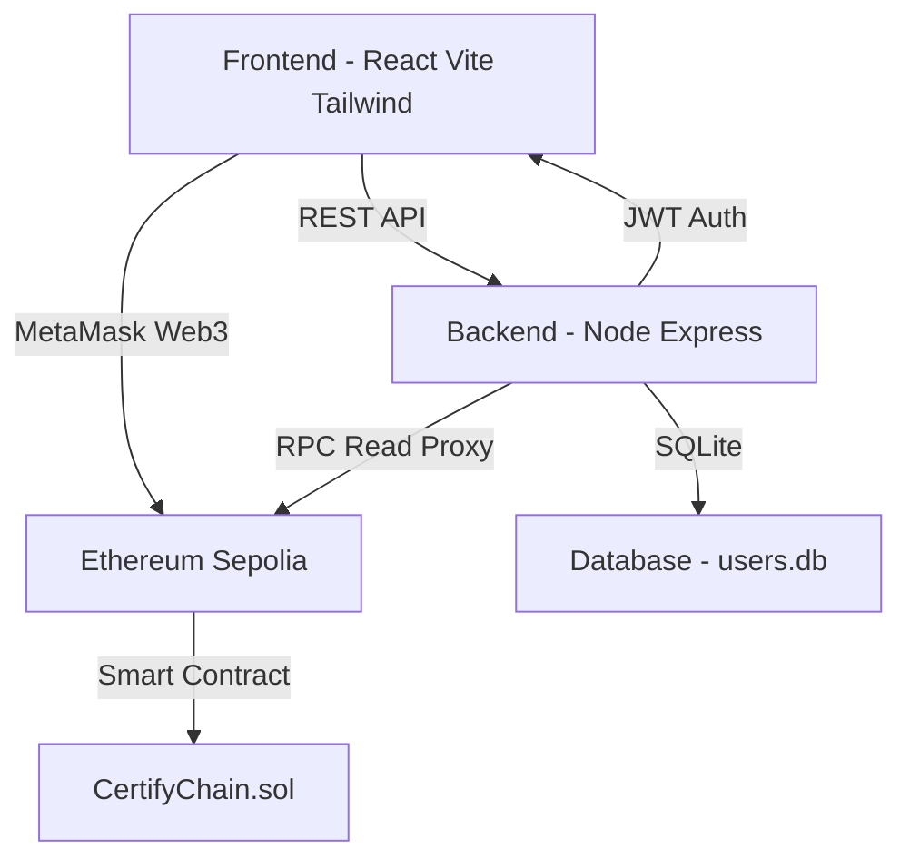

# The Hexagon Ledger: Blockchain-Based Skill Credentialing System

[](LICENSE)
[](https://sepolia.etherscan.io/)
[](https://soliditylang.org/)
[](cert-frontend)
[](cert-backend)
[](https://www.sih.gov.in/)

> A decentralized blockchain skill credentialing and certificate verification system built on Ethereum Sepolia, React, and Node.js. Delivers tamper-proof, interoperable, instantly verifiable digital credentials for vocational learners and employers via cryptographic QR codes.

---

## Table of Contents

- [1. Project Overview](#1-project-overview)
- [2. Problem Statement (SIH)](#2-problem-statement-sih)
- [3. Key Features](#3-key-features)
- [4. Technical Architecture](#4-technical-architecture)
  - [Frontend](#frontend)
  - [Backend](#backend)
  - [Database](#database)
  - [Smart Contract](#smart-contract)
- [5. Setup & Installation](#5-setup--installation)
  - [Prerequisites](#prerequisites)
  - [Environment Variables](#environment-variables)
  - [Running with Docker](#running-with-docker)
  - [Running Manually](#running-manually)
- [6. Usage Guide](#6-usage-guide)
  - [Learner Workflow](#learner-workflow)
  - [Employer Workflow](#employer-workflow)
- [7. Smart Contract Details](#7-smart-contract-details)
- [8. Demo Examples & Verification Results](#8-demo-examples--verification-results)
- [9. Future Enhancements](#9-future-enhancements)
- [10. Contributing](#10-contributing)
- [11. Team](#11-team)
- [12. License](#12-license)

---

## 1. Project Overview

The **Hexagon Ledger** is a decentralized application (dApp) designed to eliminate vocational certificate fraud and simplify credential verification across India. Built for the **Smart India Hackathon (SIH)**, the platform anchors SHA-256 certificate fingerprints directly onto the Ethereum Sepolia blockchain through the `CertifyChain` smart contract.

Learners retain permanent, self-sovereign ownership of their vocational qualifications, while employers and training partners can instantly verify authenticity in seconds using camera QR scanning or cryptographic hash comparison.

---

## 2. Problem Statement (SIH)

- **Problem ID:** 25200  
- **Ministry:** Ministry of Skill Development and Entrepreneurship (MSDE)  
- **Title:** Blockchain-Based Skill Credentialing System  

### Core Industry Challenges
1. **Certificate Forgery:** High prevalence of counterfeit paper and digital certificates.
2. **Lack of Interoperability:** Siloed institutional databases that cannot cross-verify records.
3. **Absence of Lifelong Records:** Learners lose access to historical certification when institutions close or switch portals.
4. **Slow Verification Pipelines:** Manual, paper-based employer background verification takes weeks.

**Hexagon Ledger** solves this with an immutable, transparent, and decentralized verification protocol.

---

## 3. Key Features

### For Learners
- **Self-Sovereign Identity:** Connect via MetaMask; no centralized intermediary controls your credentials.
- **Client-Side Cryptographic Hashing:** Certificates (PDF/PNG/JPG) are hashed locally using the Web Crypto API (SHA-256) before touching the network.
- **On-Chain Issuance:** Permanent timestamped proof minted onto Sepolia testnet.
- **Portable QR Credentials:** Download a cryptographic QR code that embeds wallet identity for single-scan verification.
- **Unified Portfolio:** Manage multiple vocational certifications under one wallet.

### For Employers & Verifiers
- **Zero-Friction Verification:** Scan learner QR codes in real-time using device cameras or upload QR images.
- **Hash Comparison Engine:** Upload candidate certificate files to immediately verify whether their cryptographic hash matches the on-chain ledger.
- **Tamper-Proof Audit Trail:** View issuing authority address, block timestamp, and cryptographic proof on Sepolia Etherscan.

---

## 4. Technical Architecture

### System Architecture Diagram


```mermaid
graph TD
    A[Frontend - React Vite Tailwind] -->|REST API| B[Backend - Node Express]
    A -->|MetaMask Web3| C[Ethereum Sepolia]
    B -->|SQLite| D[Database - users.db]
    B -->|RPC Read Proxy| C
    B -->|JWT Auth| A
    C -->|Smart Contract| E[CertifyChain.sol]
```

### Frontend

- **Stack:** React.js, Vite, Tailwind CSS, Framer Motion
- **Web3 & Tooling:** `ethers.js` (v5/v6), `qrcode.react`, `html5-qrcode`, `jsQR`, `lucide-react`, `react-router-dom`, `axios`
- **Key Responsibilities:**
  - Client-side SHA-256 file hashing via Web Crypto API.
  - MetaMask transaction dispatch and signature management.
  - Responsive QR code generation, camera scanning, and image decoding.

#### Core Routes
- `/` — Landing page and login portal
- `/register` — Account registration (Learner / Employer)
- `/dashboard` — Role-based dashboard view
- `/upload` — Certificate upload and hash generation (Learner)
- `/issue` — MetaMask on-chain issuance flow (Learner)
- `/verify` — QR scanner and hash comparison portal (Employer)
- `/profile` — Account and connected wallet settings

### Backend

- **Stack:** Node.js, Express.js, SQLite3
- **Security:** `bcryptjs` (password hashing), `jsonwebtoken` (JWT auth), `dotenv`, `cors`
- **Key Responsibilities:**
  - Authenticates users and stores account credentials safely in SQLite.
  - Acts as a **read proxy** for Ethereum Sepolia RPC calls, preventing client-side API rate throttling and securing provider keys.
  - Validates and compares uploaded certificate hashes against on-chain records.

#### REST Endpoints
- `POST /api/auth/register` — Register a new user (`learner` or `employer`).
- `POST /api/auth/login` — Authenticate and receive signed JWT.
- `GET /api/credentials/:walletAddress` — Fetch all on-chain credentials for a wallet.
- `POST /api/credentials/compare` — Compare a submitted file hash with on-chain records.
- `GET /api/profile` — Retrieve authenticated user profile.

### Database

- **Engine:** SQLite (file-based at `cert-backend/users.db`)
- **Schema:**
```sql
CREATE TABLE users (
  id INTEGER PRIMARY KEY AUTOINCREMENT,
  username TEXT UNIQUE NOT NULL,
  password TEXT NOT NULL,
  role TEXT NOT NULL,
  wallet_address TEXT
);
```
> *Note: Only user credentials and roles are stored in SQLite. All certificate hashes and proof records are exclusively stored on the Ethereum blockchain.*

### Smart Contract

- **Network:** Ethereum Sepolia Testnet
- **Language:** Solidity (`CertifyChain.sol`)
- **Data Model:**
```solidity
struct Credential {
    string certHash;
    uint256 timestamp;
    address issuer;
}

mapping(address => Credential[]) public credentials;
```

---

## 5. Setup & Installation

### Prerequisites

- [Git](https://git-scm.com/)
- [Node.js](https://nodejs.org/) (v18.x or higher) & `npm`
- [MetaMask](https://metamask.io/) browser extension configured for Sepolia Testnet
- Sepolia testnet ETH from a faucet (e.g., [Alchemy Sepolia Faucet](https://sepoliafaucet.com/))
- Docker & Docker Compose *(optional)*

### Environment Variables

#### Backend (`cert-backend/.env`)
```env
PORT=3001
API_URL="https://eth-sepolia.g.alchemy.com/v2/YOUR_API_KEY"
PRIVATE_KEY="YOUR_SEPOLIA_PRIVATE_KEY"
CONTRACT_ADDRESS="0xYOUR_DEPLOYED_CERTIFYCHAIN_CONTRACT"
JWT_SECRET="your_super_secret_jwt_key_here"
```

#### Frontend (`cert-frontend/.env`)
```env
VITE_API_BASE_URL="http://localhost:3001"
```

### Running with Docker

```bash
# Clone the repository
git clone https://github.com/Blackx16/hexledger.git
cd hexledger

# Build and start services
docker-compose up --build
```
Access the application at `http://localhost:5173`.

### Running Manually

#### 1. Start the Backend API
```bash
cd cert-backend
npm install
npm start
```
The backend server runs on `http://localhost:3001`.

#### 2. Start the Frontend Client
```bash
cd ../cert-frontend
npm install
npm run dev
```
Open `http://localhost:5173` in your browser.

---

## 6. Usage Guide

### Learner Workflow
1. **Register / Login:** Create an account with role `learner`.
2. **Connect Wallet:** Link MetaMask to Ethereum Sepolia.
3. **Upload Certificate:** Select certificate file (PDF/Image). The browser computes its SHA-256 fingerprint locally.
4. **Issue Credential:** Sign the `issueCredential` transaction through MetaMask.
5. **Download QR Code:** Obtain your unique verification QR badge for job applications and CVs.

### Employer Workflow
1. **Register / Login:** Create an account with role `employer`.
2. **Scan / Enter ID:** Scan learner QR code or enter candidate wallet address.
3. **Inspect Records:** Review on-chain certificates, issuing authorities, and block timestamps.
4. **Hash Matching:** Upload candidate certificate to run automated bit-level verification against blockchain state.

---

## 7. Smart Contract Details

- **Contract Name:** `CertifyChain.sol`
- **Network:** Ethereum Sepolia Testnet

```solidity
// SPDX-License-Identifier: MIT
pragma solidity ^0.8.0;

contract CertifyChain {
    struct Credential {
        string certHash;
        uint256 timestamp;
        address issuer;
    }

    mapping(address => Credential[]) public credentials;

    event CredentialIssued(address indexed learner, string certHash, address indexed issuer, uint256 timestamp);

    function issueCredential(address _learner, string memory _certHash) external {
        credentials[_learner].push(Credential(_certHash, block.timestamp, msg.sender));
        emit CredentialIssued(_learner, _certHash, msg.sender, block.timestamp);
    }

    function getCredentials(address _learner) external view returns (Credential[] memory) {
        return credentials[_learner];
    }
}
```

---

## 8. Demo Examples & Verification Results

| Verification Mode | Input | Verification Time | Result |
|---|---|---|---|
| Live Camera QR Scan | Learner Identity QR | < 1.2s | Validated On-Chain |
| Direct Wallet Lookup | 0xLearnerAddress... | < 800ms | 3 Active Credentials Fetched |
| SHA-256 Hash Compare | Uploaded Diploma.pdf | < 400ms | 100% Cryptographic Match |

## 9. Future Enhancements

- [ ] **IPFS / Arweave Storage:** Decentralized off-chain metadata hosting.
- [ ] **Decentralized Identifiers (DIDs):** W3C Verifiable Credentials compliance.
- [ ] **DigiLocker Integration:** Direct sync with Indian national credential repository.
- [ ] **Polygon / L2 Migration:** Low-cost, high-throughput micro-transactions for mass certification.
- [ ] **Role-Based Issuer Verification:** Institution-only cryptographic signing keys.

---

## 10. Contributing

Contributions, issues, and feature requests are welcome!

1. Fork the Project (`https://github.com/Blackx16/hexledger/fork`)
2. Create your Feature Branch (`git checkout -b feature/AmazingFeature`)
3. Commit your Changes (`git commit -m 'Add some AmazingFeature'`)
4. Push to the Branch (`git push origin feature/AmazingFeature`)
5. Open a Pull Request

Please review our [Contributing Guidelines](CONTRIBUTING.md) and [Code of Conduct](CODE_OF_CONDUCT.md) before submitting code.

---

## 11. Team

Developed for the **Smart India Hackathon (SIH 2024)** — Problem Statement 25200:
- **Project Lead & Development:** [@Blackx16](https://github.com/Blackx16)

---

## 12. License

Distributed under the **MIT License**. See [`LICENSE`](LICENSE) for more information.
